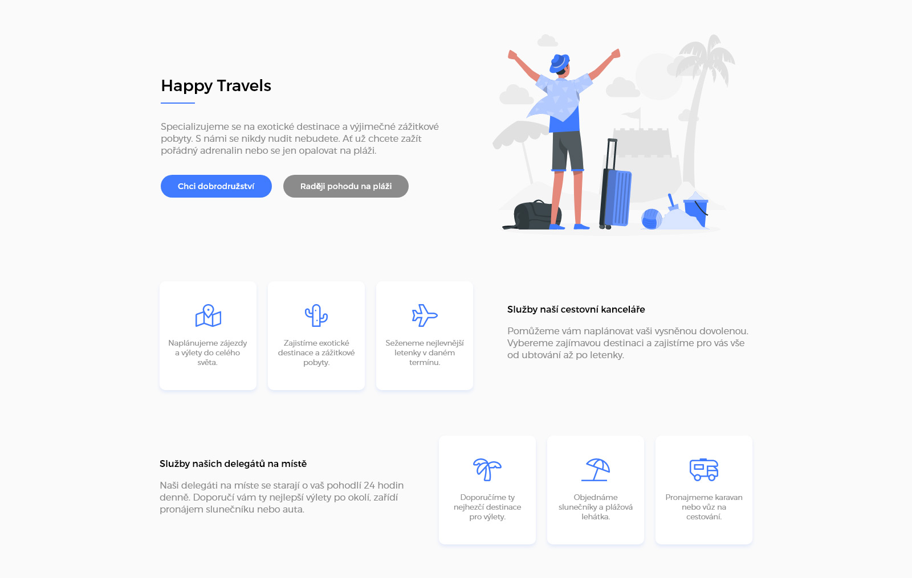

# Služby

Povinný úkol pro kurz Staň se kóderkou od Czechitas.

- [Cíl úkolu](#Cíl-úkolu)
- [Grafické zadání](#Grafické-zadání)
- [Jak si stáhnout podklady](#Jak-si-stáhnout-podklady)

Než začneš s projektem cokoliv dělat, přečti si prosím celý tento text až do konce.

Za úkol máš nakódovat design podle grafického návrhu. Jedná se o stránku s nabídkou služeb fiktivní cestovní kanceláře. Na výsledný vzhled projektu se podívej na obrázku *ukazka-vysledku.jpg*.

Tentokrát budeš mít jako jediný podklad pro zadání grafický návrh vyexportovaný v módu pro vývojáře z Adobe XD.

## Cíl úkolu

Cílem projektu je procvičit si použití různých technik:
- **Vytvoření stránky z nuly**
  - tentokrát nemáš připravený žádný kód
  - udělej si klon repozitáře a v něm si sma vytvoř HTML a CSS soubor, připoj písma, stáhni obrázky
- **Práce s grafickým návrhem**
  - v tomto projektu máš jako podklady [grafický návrh vyexportovaný z Adobe XD](https://xd.adobe.com/view/6fa92a1c-946c-4745-9c2e-2820ef34d36d-3afa/grid/)
  - v návrhu si sama změříš potřebné rozměry, vyexportuješ si z něho obrázky, zjistíš barvy a použitá písma
  - návod, jak pracovat s návrhem, najdeš v [krátkém YouTube videu (20 min)](https://youtu.be/1ih_ZYdmNPU)
  - obrázky jdou z návrhu vyexportovat z mobilního, tabletového i počítačového rozložení, ale stále se jedná o ty stejné obrázky (hlavní obrázek + 6 ikon) - stačí je tedy vyexportovat jednou z jakékoliv verze
- **Responzivní webdesign**
  - stránka je plně responzivní - má mobilní, tabletovou i počítačovou verzi
  - všechny responzivní varianty jsou obsažené v grafickém návrhu
- **Flexbox**
  - každé sekce na stránce obsahuje prvky poskládané vedle sebe - ideální práce pro flexbox
  - nezapomeň, že flexboxy se mohou do sebe vnořovat
  - často je jednodušší udělat jeden flexbox, který dá vedle sebe levou a pravou polovinu každé sekce, a potom uvnitř udělat druhý flexbox, který vedle sebe dává kartičky s jednotlivými službami

## Grafické zadání

Všechny potřebné obrázky, rozměry, použitá písma, barvy, apod. najdeš online v [grafickém návrhu vyexportovaném z Adobe XD](https://xd.adobe.com/view/6fa92a1c-946c-4745-9c2e-2820ef34d36d-3afa/grid/).

Pro případ, že bys chtěla pracovat offline nebo si chtěla s návrhem hrát, ve složce *Adobe-DX-navrh* máš k dispozici soubor *HappyTravels.xd*, který si můžeš otevřít v Adobe XD u sebe na počítači (máš li Adobe XD nainstalované).

Grafický návrh obsahuje 3 plátna s rozložením webu pro mobil, tablet a počítač, 1 plátno s návodem na práci s návrhem, a 1 plátno s wireframem pro počítačovou verzi.

Podívej se na [krátké YouTube video (20 min)](https://youtu.be/1ih_ZYdmNPU), kde ti ukážeme, jak s návrhem pracovat.

## Jak si stáhnout podklady

1. Udělej si **fork** této repozitáře - tím se ti úkol zkopíruje do tvého GitHub profilu.
2. Forknutou repozitář si naklonuj k sobě na disk.

Pokud nevíš, co je to **fork repozitáře** a jak ho provést, podívej se na [krátké video](https://youtu.be/K7rE3jRCjD4).
